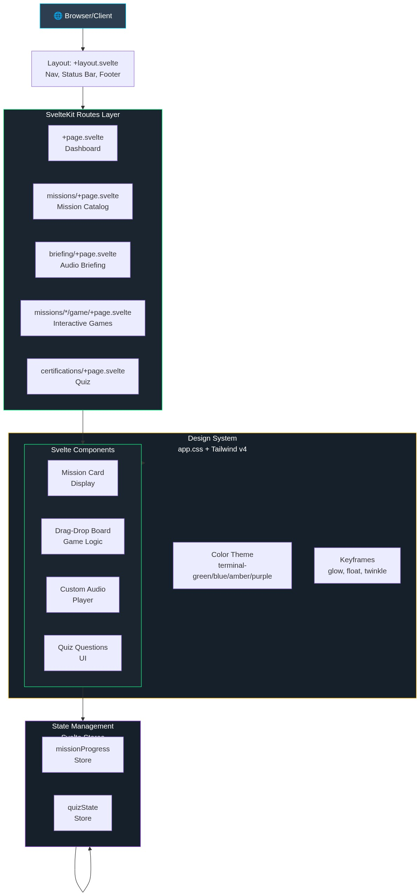
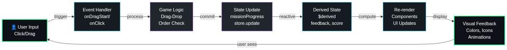
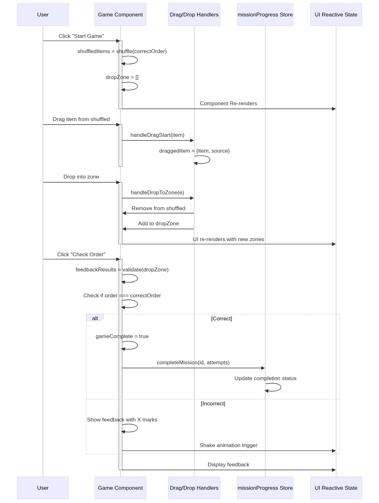

# Mission Control — System Diagrams

> PNG diagrams generated in `./output/diagrams/`

---

## 1. Architecture Overview

This diagram shows how Mission Control is layered from browser to styling system. The browser loads a SvelteKit application with a layout shell (+layout.svelte) that provides navigation and consistent theming. Routes handle different pages (missions, games, briefing, certification), which compose Svelte components that handle UI rendering. State is managed through reactive Svelte stores (missionProgress, quizState), and all styling flows from the design system (Tailwind v4 + custom app.css).

**Reading this diagram:**
- **Routes → Components → State:** Data flows downward, reactivity flows upward
- **State Management Isolation:** Game logic updates stores, components subscribe reactively without imperative coupling
- **Design System Integration:** Every component uses the unified color theme and animation keyframes from app.css
- **Layout as Root:** The +layout.svelte acts as a shell, ensuring consistent header/footer/navigation across all routes

---

## 2. Data Flow

This shows the lifecycle of a typical user interaction in a mission game. User input (drag-drop) triggers event handlers, which process game logic (order checking), update the Svelte store (missionProgress), derive reactive state ($derived), trigger re-renders, and display visual feedback. The cycle completes when the user sees the result and can interact again.

**What to notice:**
- **Reactive Loop:** Store updates automatically propagate to derived state without manual subscriptions
- **Visual Feedback Layers:** Logic → Store → Derived → Render → Visual Feedback creates smooth UX with clear separation of concerns
- **User Agency:** The cycle returns to user input, allowing immediate retry/adjustment without page reload
- **Store as Source of Truth:** All game state lives in stores, making progress persistent (within session) and shareable across components

---

## 3. Key Interaction: Game Sequence

This shows a complete game session from launch through order validation. When the user clicks "Start Game," the component shuffles items and clears the drop zone. The user then drags items from the shuffled pool into the drop zone. Finally, clicking "Check Order" validates the sequence against the correct answer, either showing success or triggering the shake feedback animation.

**Step by step:**
1. User clicks "Start Game" → Component shuffles correct order array randomly
2. Component renders two zones: shuffled items (left) and drop zone (right)
3. User drags items from shuffled → draggedItem state captures item + source
4. User drops into zone → handlers remove from source, add to destination
5. User clicks "Check Order" → component compares dropZone order to correctOrder array
6. If correct: gameComplete = true, store updates with completion + attempt count
7. If incorrect: feedbackResults show mismatches with X marks, drop zone shakes

---

## Component Reference

| Component | Layer | Responsibility |
|-----------|-------|----------------|
| **+layout.svelte** | Root | Navigation bar, status bar, footer wrapper for all pages |
| **+page.svelte** | Routes | Homepage with dual-mode toggle (technical ↔ mission language) |
| **missions/+page.svelte** | Routes | Mission catalog grid with cards for each chaining pattern |
| **missions/*/game/+page.svelte** | Routes | Interactive drag-drop game for each mission type |
| **briefing/+page.svelte** | Routes | Audio player and educational briefing content |
| **certifications/+page.svelte** | Routes | 5-question quiz assessment with scoring |
| **missionProgress** | State | Svelte store tracking completion, attempts, best scores per mission |
| **quizState** | State | Svelte store tracking quiz progress and certification status |
| **app.css** | Styling | Tailwind v4 theme with terminal colors, animations, component utilities |

---

## Design Principles

- **State-Driven:** All game logic derives from Svelte reactive stores; components are presentation layer only
- **Immersive Narrative:** Every interaction has mission-critical framing (e.g., "Signal closes in T-minus 4 minutes")
- **Dual Conceptualization:** Each concept has technical name and mission equivalent, teaching pattern abstraction
- **Immediate Feedback:** Drag-drop validation is instant; no network latency or loading states
- **Progress Tracking:** Global store enables progress persistence across page navigations (within session)
- **No Backend Dependency:** Entire experience is client-side; deployable as static SPA
