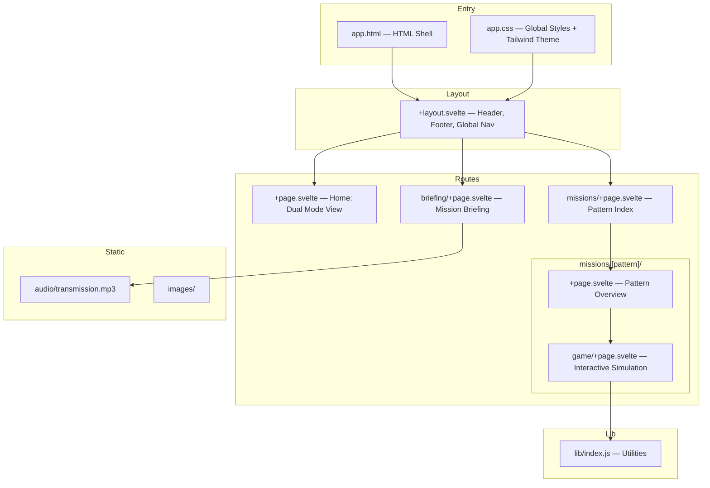
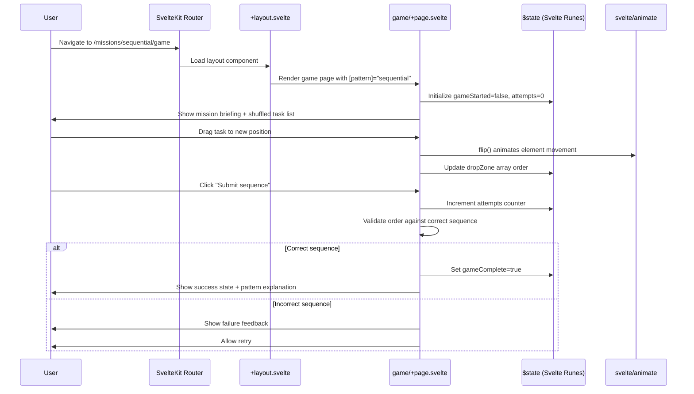

# Prompt Chaining: Interactive Learning Platform — A Technical Lecture

## Course Information
**Subject:** AI Prompt Engineering — Orchestration Patterns & SvelteKit Application Architecture  
**Level:** Intermediate  
**Estimated Time:** 45–60 minutes  
**Prerequisites:** Basic JavaScript, familiarity with APIs, introductory understanding of LLMs

---

## Learning Objectives

By the end of this lecture, you will be able to:

1. Explain the seven core prompt chaining patterns and when to apply each one
2. Describe how SvelteKit's file-based routing maps to real application structure
3. Understand how Svelte 5 runes replace traditional state management patterns
4. Analyze why UI metaphor (mission control) is an architectural decision, not a cosmetic one
5. Design your own interactive educational tool using this project as a reference pattern

---

## Part 1: The Problem Space

Imagine you are a chef who has just learned to cook individual ingredients perfectly. You can roast a carrot. You can sear a steak. You can reduce a sauce. But the moment you need to run a full dinner service — twelve plates, five courses, coordinated timing — your single-dish skills are not enough. You need a *system*. You need to know which dish starts first, which can run in parallel, what to do when the oven breaks mid-service.

Prompt engineering has exactly this problem.

Most AI engineers learn to write a good prompt. They learn to be specific, to give examples, to set a persona. But production AI systems rarely involve a single prompt. They involve chains: a prompt that summarizes a document feeds into a prompt that extracts action items, which feeds into a prompt that drafts a reply. Each step depends on the last. Each failure cascades forward.

The patterns that govern these chains — sequential, branching, iterative, hierarchical, conditional, recursive, reverse — are not obvious. Documentation explains them abstractly. Diagrams show them statically. But neither approach answers the real question a practitioner asks: *what does it feel like to use each pattern, and how do I know when I've chosen the wrong one?*

This project answers that question by making you *do* it. You sequence tasks under pressure. You watch chains break. You feel the difference between parallel branches and sequential steps. The space mission metaphor is not decoration — it is the teaching mechanism. Mission control operators face exactly the coordination problems prompt engineers face: parallel tasks, sequential dependencies, decision gates, recursive breakdowns. The analogy is not aesthetic. It is pedagogical architecture.

---

## Part 2: The Architecture

The application is built on SvelteKit with file-based routing. Think of the route structure as a physical building: the layout is the lobby everyone passes through, the missions directory is a wing of rooms, and each pattern gets its own room with two doors — an overview door and a game door.



**Reading this diagram:**
- Every route flows through `+layout.svelte` — this is where the header, footer, and global nav live. Change it once, it changes everywhere.
- The `[pattern]` segment is a dynamic route. SvelteKit resolves `missions/sequential` and `missions/recursive` using the same file — only the pattern name changes.
- The split between `+page.svelte` (overview) and `game/+page.svelte` (simulation) is a deliberate separation of concerns: learn first, do second. This mirrors the pedagogical flow.
- Static assets (audio, images) live outside the route tree. They are not reactive — they are resources fetched by components.

---

## Part 3: Core Concepts

### 3.1 Prompt Chaining — The Foundation Concept

**Plain English:** Prompt chaining means using the output of one AI prompt as the input to the next. Instead of asking one question and getting one answer, you build a pipeline where each step refines, transforms, or routes the result from the step before.

**Real-world analogy:** An assembly line. Raw steel enters one end. At each station, a specific operation is performed. No station knows about the others — it only receives input and produces output. The car that emerges at the end is the product of coordinated sequential transformation.

**In this codebase:** Each mission simulation represents one chaining pattern. The game mechanic — drag tasks into the correct order — is itself a physical representation of understanding chain sequencing. When you place "Extract entities" before "Summarize document," you are constructing a chain.

**The seven patterns covered:**

| Pattern | What It Does | When To Use |
|---------|-------------|-------------|
| Sequential | Output of step N feeds step N+1 | Linear pipelines with no branching |
| Branching | Multiple parallel operations on the same input | When tasks are independent |
| Iterative | Loop and refine until a quality threshold is met | When first output is rarely final |
| Hierarchical | Nested chains — a chain that contains chains | Complex tasks with sub-tasks |
| Conditional | Decision gate: route based on output content | When downstream path depends on result |
| Recursive | Divide-and-conquer: apply same chain to each piece | When input is too large for one prompt |
| Reverse | Work backward from desired output | When you know what you want but not how to get there |

---

### 3.2 SvelteKit File-Based Routing

**Plain English:** In SvelteKit, the URL structure of your application mirrors the folder structure of your `src/routes/` directory. A file at `src/routes/missions/sequential/+page.svelte` is automatically available at `/missions/sequential`. No route registration needed.

**Real-world analogy:** A filing cabinet. The drawer is the top-level route. The folder inside is the sub-route. The document inside the folder is the page component. The cabinet's organization *is* the navigation structure.

**In this codebase:**
```
src/routes/
├── +layout.svelte          → wraps every page
├── +page.svelte            → renders at /
├── briefing/+page.svelte   → renders at /briefing
├── missions/+page.svelte   → renders at /missions
└── missions/[pattern]/
    ├── +page.svelte        → renders at /missions/sequential, /missions/recursive, etc.
    └── game/+page.svelte   → renders at /missions/sequential/game
```

The `[pattern]` bracket syntax makes the segment dynamic. SvelteKit passes the matched value as a parameter, so the same component renders for all seven patterns — it just receives different data depending on the URL.

**Why this matters for prompt chaining education:** Adding a new pattern is a three-step operation — create a folder, write two files, update one array. The architecture enables curriculum growth without architectural debt.

---

### 3.3 Svelte 5 Runes — Reactive State

**Plain English:** Svelte 5 introduces "runes" — special syntax that tells Svelte which variables should trigger UI updates when they change. `$state` creates a reactive variable. `$derived` creates a value that automatically recalculates when its dependencies change.

**Real-world analogy:** A spreadsheet. When you change a cell, every formula that references it updates automatically. You don't manually trigger recalculation — the dependency is declared, and the system handles the rest. `$state` is a cell with a value. `$derived` is a formula cell.

**In this codebase:**
```svelte
<script>
  let gameStarted = $state(false);
  let attempts = $state(0);
  let gameComplete = $state(false);

  let progress = $derived(completedTasks / totalTasks);
</script>
```

`gameStarted`, `attempts`, and `gameComplete` are reactive state — when any of them changes, Svelte re-renders the parts of the UI that reference them. `progress` is derived — it recalculates automatically whenever `completedTasks` or `totalTasks` changes. No event listeners. No manual subscriptions. No Redux actions.

**Why this matters:** The game simulations require tracking multiple simultaneous state variables — task order, attempt count, completion status, animation state. Runes handle this cleanly without introducing external state management libraries.

---

### 3.4 Tailwind CSS and the Space Theme as Architecture

**Plain English:** Tailwind CSS provides utility classes that apply single CSS properties directly in HTML. Instead of writing `.button { background: blue; padding: 8px; }` in a separate file, you write `class="bg-blue-500 p-2"` directly on the element.

**Real-world analogy:** LEGO bricks vs. custom-molded parts. Tailwind gives you standardized bricks you can combine in any configuration. Custom CSS gives you a part molded for one specific use — useful, but not recombinable.

**In this codebase — the critical insight:**
```css
@theme {
  --color-space-950: #0a0a0f;
  --color-terminal-green: #00ff88;
  --color-terminal-blue: #00d4ff;
}
```

This is not cosmetic configuration. The space theme is the UX language. When users see `--color-terminal-green`, they are reading output. When they see `--color-terminal-blue`, they are in an interactive state. The color system carries semantic meaning — it teaches users how to read the interface before they consciously learn the conventions.

This is why the README states: *"The visual metaphor isn't just theme; it's narrative architecture."* The design decision is a pedagogical decision.

---

### 3.5 Drag-and-Drop with Svelte Animate

**Plain English:** The game mechanic — dragging tasks into the correct sequence — uses Svelte's built-in `flip` animation. FLIP stands for First, Last, Invert, Play — a technique that calculates an element's starting position, its ending position, and animates the transition between them.

**Real-world analogy:** Sorting physical index cards on a table. When you move one card, the others shift smoothly to fill the gap. FLIP animation replicates this natural spatial movement in a browser.

**In this codebase:**
```svelte
<script>
  import { flip } from 'svelte/animate';
  let dropZone = $state([]);
</script>

{#each dropZone as item (item.id)}
  <div animate:flip={{ duration: 300 }}>
    {item.label}
  </div>
{/each}
```

The `(item.id)` keying is critical — it tells Svelte to track items by identity, not by position. Without it, Svelte would re-render the list rather than animate element movement. The 300ms duration is fast enough to feel responsive, slow enough to make the reordering legible.

---

## Part 4: How It All Comes Together

When a user arrives at `/missions/sequential/game` and completes a simulation, this is the exact sequence of events:



**Step by step:**

1. The router matches the URL to `game/+page.svelte` and passes `sequential` as the pattern parameter
2. The layout wraps the page — header and nav are already rendered
3. The game component initializes its `$state` variables to default values
4. Tasks are shuffled into random order on mount — this is why every attempt feels different
5. Each drag operation updates the `dropZone` array; `flip` animates the visual consequence
6. On submission, the component compares the user's sequence against the stored correct sequence
7. The result branches: success renders the explanation, failure renders the retry state

The entire interaction never leaves the client. No API calls. No server round-trips. Svelte's reactivity handles every state transition locally.

---

## Part 5: Advanced Topics

### Why No External State Management?

The decision to use Svelte 5 runes exclusively — with no Pinia, Redux, Zustand, or even Svelte stores — is a deliberate bet on colocation. Each game simulation's state lives entirely within its own component. When the user navigates away, the state is discarded. When they return, the game resets.

This works because the game state has no cross-component dependencies. The sequential game doesn't need to know about the recursive game's progress. If Phase 4 of the roadmap adds user accounts and progress persistence, this architecture would need to change — state would need to move to a server or a global store. The current design is optimal for the current scope.

**The tradeoff:** Simplicity now, refactoring cost later if the scope grows.

### File-Based Routing as Curriculum Design

The route structure is not just a technical decision — it is a curriculum sequence baked into the URL architecture. `/briefing` comes before `/missions`. `/missions/[pattern]` (the overview) comes before `/missions/[pattern]/game` (the practice). The URL path is the learning path.

This has an underappreciated implication: the navigation structure is the instructional design. If you wanted to add a prerequisite gate — "you must complete sequential before unlocking branching" — the architecture supports it. The route tree already reflects the pedagogical hierarchy.

### The Audio Briefing as Cognitive Context-Switching

`static/audio/transmission.mp3` is described as a "declassified transmission." This is not a UX flourish. Audio primes the user's mental model before they engage with the content. Hearing a mission briefing activates a different cognitive frame than reading a tutorial. The user is no longer a developer reading docs — they are an operator receiving a mission.

This is a prompt engineering principle applied to UX design: context framing changes how information is processed. The audio is a system prompt for the human.

---

## Part 6: What Could Be Better

**No test coverage.** The README roadmap acknowledges this implicitly — there are no test files in the project structure. The game validation logic (checking whether a user's sequence matches the correct sequence) is untested. For an educational tool where correctness is the product, this is the highest-priority gap.

**Static correct sequences.** Each pattern's "correct order" is hardcoded. Real prompt chaining often has multiple valid orderings — sequential steps that could run in either direction without breaking the chain. A more sophisticated validation system would accept any topologically valid ordering, not just one specific sequence.

**No progress persistence.** Completing all seven patterns resets on page refresh. Phase 4 of the roadmap addresses this, but until then, there is no way for a learner to track their progress across sessions.

**Pattern isolation.** Each pattern is taught independently. A learner who completes all seven has no synthesis exercise — no scenario that requires choosing the *right* pattern from among the seven. The hardest skill in prompt engineering is pattern selection, not pattern execution, and the current curriculum doesn't address it.

**If you were to extend this project:** The highest-value addition would be a "Pattern Selection" mode — present a scenario description, ask the user which pattern applies and why, then show them the consequences of their choice. That exercise would complete the curriculum.

---

## Knowledge Check

**Conceptual Questions:**

1. Why does the project use a space mission metaphor rather than a generic software metaphor? What pedagogical principle does this reflect?

2. A prompt chain processes a user's support ticket: first categorizing it, then routing it to the correct team, then drafting a response. Which of the seven patterns best describes this chain? Explain your reasoning.

3. What is the difference between `$state` and `$derived` in Svelte 5? Give an example of when you would use each.

4. The project README says "The visual metaphor isn't just theme; it's narrative architecture." What does this mean in concrete terms? What would change if you replaced the space theme with a generic light theme?

5. Why does file-based routing make it easier to add new prompt chaining patterns to this application compared to a manually-registered routing system?

**Technical Questions:**

6. In the game component, tasks are keyed by `item.id` in the `{#each}` block. What would break if you keyed them by index instead? What visual artifact would appear?

7. The `flip` animation is imported from `svelte/animate`, not installed as an npm package. What does this tell you about Svelte's philosophy regarding animation?

8. Look at the route structure: `missions/[pattern]/+page.svelte` and `missions/[pattern]/game/+page.svelte` share the same `[pattern]` parameter. How does SvelteKit make this parameter available to both components?

9. The Tailwind theme defines `--color-terminal-green` and `--color-terminal-blue`. Why define custom color tokens instead of using Tailwind's built-in color palette directly?

10. The roadmap's Phase 4 includes "Progress persistence" with user accounts. What would need to change in the current Svelte rune-based state architecture to support this feature? Where would state need to move?

---

## Further Reading

**[SvelteKit Documentation — Routing](https://kit.svelte.dev/docs/routing)**  
The official reference for file-based routing, dynamic segments, and layout inheritance. Essential reading before extending this project.

**[Svelte 5 Runes — Official Guide](https://svelte.dev/docs/svelte/what-are-runes)**  
Comprehensive introduction to `$state`, `$derived`, and `$effect`. Explains the motivation for moving away from Svelte stores.

**[Anthropic Prompt Chaining Guide](https://docs.anthropic.com/en/docs/build-with-claude/prompt-chaining)**  
The authoritative reference for the patterns this project teaches. Read this alongside the simulations to connect practice to theory.

**[FLIP Animation Technique — Paul Lewis](https://aerotwist.com/blog/flip-your-animations/)**  
The original article explaining the First-Last-Invert-Play technique that Svelte's `animate:flip` is based on. Understanding this helps debug animation edge cases.

**[Tailwind CSS v4 — What's New](https://tailwindcss.com/blog/tailwindcss-v4)**  
This project uses Tailwind v4, which introduces significant changes to configuration (CSS-first config via `@theme`). Required reading before modifying `app.css`.

**[Instructional Design for Interactive Learning — Nielsen Norman Group](https://www.nngroup.com/articles/learning-by-doing/)**  
Research backing the "learn by doing" approach this project embodies. Useful if you are extending the curriculum or building similar educational tools.

---

## Summary

This project teaches prompt chaining patterns by making you physically sequence tasks under pressure — a pedagogical approach grounded in kinesthetic learning. The SvelteKit architecture mirrors the curriculum structure: routes are learning paths, components are teaching units, and the space theme is a cognitive frame, not decoration. Svelte 5 runes handle complex game state without external dependencies, and file-based routing makes the curriculum extensible by design.

The gap the project leaves is synthesis: a learner who masters all seven patterns still hasn't practiced choosing between them. That is the skill that separates competent prompt engineers from exceptional ones, and it is the most valuable extension this curriculum could receive.

To go deeper: run the simulations at `/missions/[pattern]/game` for all seven patterns, then return to the overview pages and ask yourself why each pattern exists — what problem would arise if you used sequential where branching was correct. That metacognitive exercise is the lecture's final lesson.
